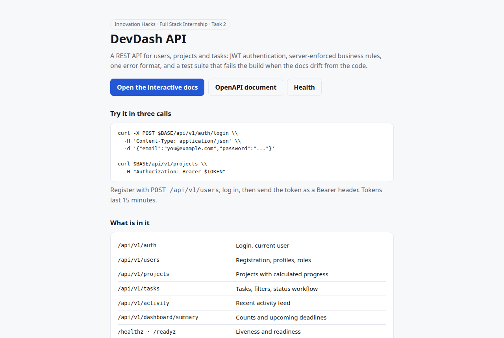

# DevDash API: users, projects and tasks

Task 2 of the Innovation Hacks Full Stack Development Internship: the backend for the Task 1
dashboard, built with **FastAPI** to the _Users, Projects & Tasks API Engineering Standards Pack
(Task 2)_. Twenty-three documented operations under `/api/v1`, one error envelope, bearer-token
authentication, business rules enforced on the server, and a test gate that fails the build when
the code, the tests or the OpenAPI document drift apart.

  

- **Live API:** https://ih-task2-api.onrender.com ([docs](https://ih-task2-api.onrender.com/docs)). The free tier sleeps, so the first request can take about a minute. It is seeded demo data that resets on restart (see [Deploying](#deploying))
- **Interactive docs:** `/docs` (Swagger UI), on in development, off in production
- **Demo video:** _add the link after recording, see [DEMO_SCRIPT.md](DEMO_SCRIPT.md)_
- **Standards:** [docs/standards/](docs/standards/) · **Decisions:** [docs/adr/](docs/adr/) ·
  **Task 1 compatibility:** [docs/compatibility-task1.md](docs/compatibility-task1.md)

## Tour

| | |
| --- | --- |
|  **Welcome page** (`GET /`): what the service is, links to the docs and a three-call example |  **Interactive docs** (`/docs`): every operation grouped by resource, generated from the code |


**A business rule in action.** In Swagger UI, `PATCH /api/v1/tasks/{taskId}/status` with
`{"status": "done"}` on a task that is still `todo` returns `409 INVALID_STATUS_TRANSITION`. The
error names the statuses that are allowed (`in_progress`), and carries a `requestId` that matches the
`X-Request-ID` header and the server log. The security headers are visible too. The screenshots come
from a local run with seeded demo data.

## Run it (3 commands)

You need [uv](https://docs.astral.sh/uv/) (it installs Python 3.12 for you).

```bash
uv sync --frozen                                                                 # 1. install
export SECRET_KEY=$(python3 -c 'import secrets; print(secrets.token_urlsafe(48))')  # 2. configure
SEED_PROFILE=default uv run uvicorn app.main:create_app --factory --reload       # 3. run, with demo data
```

Open http://127.0.0.1:8000/docs. With `SEED_PROFILE=default` and no `SEED_PASSWORD`, a random
password for the seeded accounts is printed once to the console at startup (the lead is
`amara.diallo@example.com`). Nothing has a default credential. To keep settings in a file instead,
copy `.env.example` to `.env` and fill in `SECRET_KEY`.

## Configuration

Every setting comes from the environment and is validated at startup. A missing or invalid value
stops the app and names the variable. `.env.example` is the source of truth and a test fails if a
setting is missing from it.

| Variable | Default | Meaning |
| --- | --- | --- |
| `APP_ENV` | `development` | `development`, `test` or `production`. Production turns Swagger UI off and adds HSTS. |
| `HOST` | `127.0.0.1` | Bind address. The Docker image binds `0.0.0.0`. |
| `PORT` | `8000` | Port. |
| `LOG_LEVEL` | `info` | `debug`, `info`, `warning` or `error`. |
| `SECRET_KEY` | required | JWT signing key, at least 32 bytes. |
| `JWT_ISSUER` | `devdash-api` | `iss` claim, checked on every request. |
| `JWT_AUDIENCE` | `devdash-clients` | `aud` claim, checked on every request. |
| `ACCESS_TOKEN_TTL_SECONDS` | `900` | Token lifetime (60 to 86400). |
| `CORS_ORIGINS` | empty | Comma-separated allowed origins. A wildcard is refused. |
| `DOCS_ENABLED` | empty | Empty means on in development, off in production. |
| `MAX_BODY_BYTES` | `1048576` | Request body limit (413 above it). |
| `REQUEST_TIMEOUT_SECONDS` | `30` | Per-request timeout. |
| `RATE_LIMIT_ATTEMPTS` | `5` | Login and registration attempts allowed per window. |
| `RATE_LIMIT_WINDOW_SECONDS` | `60` | The window. |
| `ARGON2_TIME_COST` | `3` | argon2id time cost. Lower only in tests. |
| `ARGON2_MEMORY_KIB` | `65536` | argon2id memory cost. Lower only in tests. |
| `SEED_PROFILE` | `none` | `none`, `default`, `empty` or `large`. Refused when `APP_ENV=production`. |
| `SEED_PASSWORD` | empty | Password for seeded accounts; empty prints a random one. |

## Try it: authentication walkthrough

```bash
BASE=http://127.0.0.1:8000
# 1. Register (public). New accounts are always developers.
curl -s -X POST $BASE/api/v1/users -H 'Content-Type: application/json' \
  -d '{"name":"Ada Lovelace","email":"ada@example.com","password":"correct-horse-battery"}'

# 2. Log in and keep the token.
TOKEN=$(curl -s -X POST $BASE/api/v1/auth/login -H 'Content-Type: application/json' \
  -d '{"email":"ada@example.com","password":"correct-horse-battery"}' | python3 -c 'import sys,json; print(json.load(sys.stdin)["accessToken"])')

# 3. Who am I?
curl -s $BASE/api/v1/auth/me -H "Authorization: Bearer $TOKEN"
```

Tokens last 15 minutes. An unknown email and a wrong password give the same `401
INVALID_CREDENTIALS`. Login and registration are rate limited (429 with `Retry-After`).

## Endpoints

Every route except registration, login and the health checks needs `Authorization: Bearer <token>`.
JSON is camelCase, ids are UUIDs, dates are ISO 8601, and lists take `page`, `pageSize` (1 to 100)
and `sort` (`field`, or `-field` for descending).

| Method | Path | Who | What |
| --- | --- | --- | --- |
| POST | `/api/v1/auth/login` | public | Exchange credentials for a token |
| GET | `/api/v1/auth/me` | any user | The current user |
| POST | `/api/v1/users` | public | Register (201 + `Location`) |
| GET | `/api/v1/users` | any user | List, search `q`, filter `role` |
| GET | `/api/v1/users/{userId}` | any user | One user |
| PATCH | `/api/v1/users/{userId}` | self or lead | Name, avatar, preferences; role by a lead only |
| DELETE | `/api/v1/users/{userId}` | lead | 204; 409 for the last lead or an owner of projects |
| GET | `/api/v1/projects` | any user | List, filter `status`, `ownerId`, search `q` |
| POST | `/api/v1/projects` | any user | Create; you become the owner |
| GET | `/api/v1/projects/{projectId}` | any user | One project with progress |
| PATCH | `/api/v1/projects/{projectId}` | owner or lead | Partial update |
| DELETE | `/api/v1/projects/{projectId}` | owner or lead | 204; 409 while it has tasks |
| GET | `/api/v1/projects/{projectId}/tasks` | any user | The project's tasks, same filters as `/tasks` |
| GET | `/api/v1/tasks` | any user | Filter `status`, `priority`, `projectId`, `assigneeId`, `overdue`, `dueBefore`, `dueAfter`, `q` |
| POST | `/api/v1/tasks` | project owner or lead | Create (status starts as `todo`) |
| GET | `/api/v1/tasks/{taskId}` | any user | One task |
| PATCH | `/api/v1/tasks/{taskId}` | owner, assignee or lead | Edit fields (not status) |
| PATCH | `/api/v1/tasks/{taskId}/status` | owner, assignee or lead | Move through the workflow |
| DELETE | `/api/v1/tasks/{taskId}` | owner or lead | 204 |
| GET | `/api/v1/activity` | any user | Recent activity, newest first; `limit` is the page size |
| GET | `/api/v1/dashboard/summary` | any user | Counts, completion rate and deadlines in the next 7 days |
| GET | `/` | public | Welcome page (HTML) |
| GET | `/healthz` | public | Liveness |
| GET | `/readyz` | public | Readiness (503 when a dependency is down) |

Task status workflow: `todo` → `in_progress` → `in_review` → `done`, with `in_review` → `in_progress`
and `done` → `in_progress` to reopen. Anything else is `409 INVALID_STATUS_TRANSITION`, and the
error lists the statuses that are allowed.

```bash
PROJECT=$(curl -s -X POST $BASE/api/v1/projects -H "Authorization: Bearer $TOKEN" \
  -H 'Content-Type: application/json' -d '{"name":"Atlas API Gateway","dueDate":"2026-12-01"}')
PID=$(echo "$PROJECT" | python3 -c 'import sys,json; print(json.load(sys.stdin)["id"])')

TASK=$(curl -s -X POST $BASE/api/v1/tasks -H "Authorization: Bearer $TOKEN" \
  -H 'Content-Type: application/json' -d "{\"projectId\":\"$PID\",\"title\":\"Write the migration plan\",\"priority\":\"high\"}")
TID=$(echo "$TASK" | python3 -c 'import sys,json; print(json.load(sys.stdin)["id"])')

curl -s -X PATCH $BASE/api/v1/tasks/$TID/status -H "Authorization: Bearer $TOKEN" \
  -H 'Content-Type: application/json' -d '{"status":"in_progress"}'
curl -s "$BASE/api/v1/tasks?status=in_progress&sort=-dueDate&pageSize=5" -H "Authorization: Bearer $TOKEN"
curl -s $BASE/api/v1/dashboard/summary -H "Authorization: Bearer $TOKEN"
```

## Errors

Every error, including framework errors (unknown route, wrong method, bad JSON), has one shape:

```json
{ "error": { "code": "VALIDATION_ERROR", "message": "One or more fields are invalid.",
             "details": [{ "field": "title", "message": "Must be between 1 and 120 characters." }],
             "requestId": "8f0c2e4a-3b1d-4f6e-9a57-2d7c1e9b5a10" } }
```

`requestId` matches the `X-Request-ID` response header (send your own to trace a call). Stack
traces and internals never appear in a response.

| Status | Code | When |
| --- | --- | --- |
| 400 | `MALFORMED_REQUEST` | The body is not valid JSON |
| 401 | `UNAUTHENTICATED` | Missing, malformed, expired or forged token |
| 401 | `INVALID_CREDENTIALS` | Wrong email or password (identical for both) |
| 403 | `FORBIDDEN` | Authenticated but not allowed |
| 404 | `NOT_FOUND` | Unknown id or route |
| 405 | `METHOD_NOT_ALLOWED` | Wrong method; `Allow` lists the right ones |
| 409 | `EMAIL_ALREADY_EXISTS` | Registration with an address already in use |
| 409 | `INVALID_STATUS_TRANSITION` | The workflow forbids the move |
| 409 | `PROJECT_NOT_EMPTY` | Deleting a project that has tasks |
| 409 | `PROJECT_CLOSED` | Adding a task to a completed project |
| 409 | `USER_OWNS_PROJECTS` | Deleting a user who owns projects |
| 409 | `LAST_LEAD` | Deleting or demoting the last lead |
| 413 | `PAYLOAD_TOO_LARGE` | Body over 1 MB |
| 415 | `UNSUPPORTED_MEDIA_TYPE` | Body is not `application/json` |
| 422 | `VALIDATION_ERROR` | Bad fields, unknown fields, bad query, unknown referenced id |
| 429 | `RATE_LIMITED` | Too many login or registration attempts; see `Retry-After` |
| 500 | `INTERNAL_ERROR` | Unexpected; generic message, details are in the server log |
| 503 | `SERVICE_UNAVAILABLE` | `/readyz` when a dependency is down |

## Architecture

```
app/api        routers: parse, call a service, shape the response. No business rules.
app/services   business rules and authorization. Raise AppError subclasses; never import FastAPI.
app/repositories  async Protocols + in-memory implementations behind them.
app/domain     entities, enums, pure rules, query objects.
app/core       settings, errors, logging, middleware, security, clock, rate limiter.
```

The layer rules are enforced by `import-linter` (`make layers`), not by convention. The clock and
id factory are injected, so tests control time. Swapping the in-memory store for a database means
writing a new set of repositories; a contract test suite runs against every implementation.

## The quality gate

```bash
make gate        # everything below, stops at the first failure
```

| Target | What it checks |
| --- | --- |
| `make lint` | `ruff check` and `ruff format --check` (complexity at most 10) |
| `make typecheck` | `mypy --strict` on `app`, `scripts` and `tests` |
| `make layers` | import-linter contracts |
| `make test` | pytest with coverage (threshold 90%) and the endpoint-coverage gate |
| `make spec-check` | `docs/openapi.json` equals what the app generates |
| `make spec-diff` | no breaking change against `origin/main` |
| `make contract` | Schemathesis over every operation |
| `make security` | bandit and pip-audit |
| `make postman` | the Postman collection under Newman |
| `make load` | Locust on 500 tasks, p95 thresholds |
| `make docker` | the image builds |

After changing an endpoint, run `make export-spec` and commit `docs/openapi.json`; CI fails if it is
stale. `make secrets` runs gitleaks if it is installed (CI always runs it).

## Deploying

`render.yaml` builds the Dockerfile as one worker with a `/healthz` check. In the Render dashboard
set `SEED_PASSWORD` and `CORS_ORIGINS`; `SECRET_KEY` is generated. The demo deployment is seeded
and is not `APP_ENV=production`: see [ADR-221](docs/adr/ADR-221-render-demo-seeding.md).

## Known limitations

- **State is in memory.** Everything resets on restart, and the service must run one worker (a
  second worker would hold a second, different copy of the data). Task 3 adds the database.
- **The rate limiter is per process** ([ADR-216](docs/adr/ADR-216-in-process-rate-limiter.md)).
- **Tokens cannot be revoked** before they expire (15 minutes). There is no refresh token and no
  logout endpoint; the client discards its token.
- **Task 1 features with no endpoint:** password reset, password and email change, avatar upload.
  The pack does not define them ([compatibility notes](docs/compatibility-task1.md)).
- **Registration always creates a developer.** The first lead has to be seeded.
