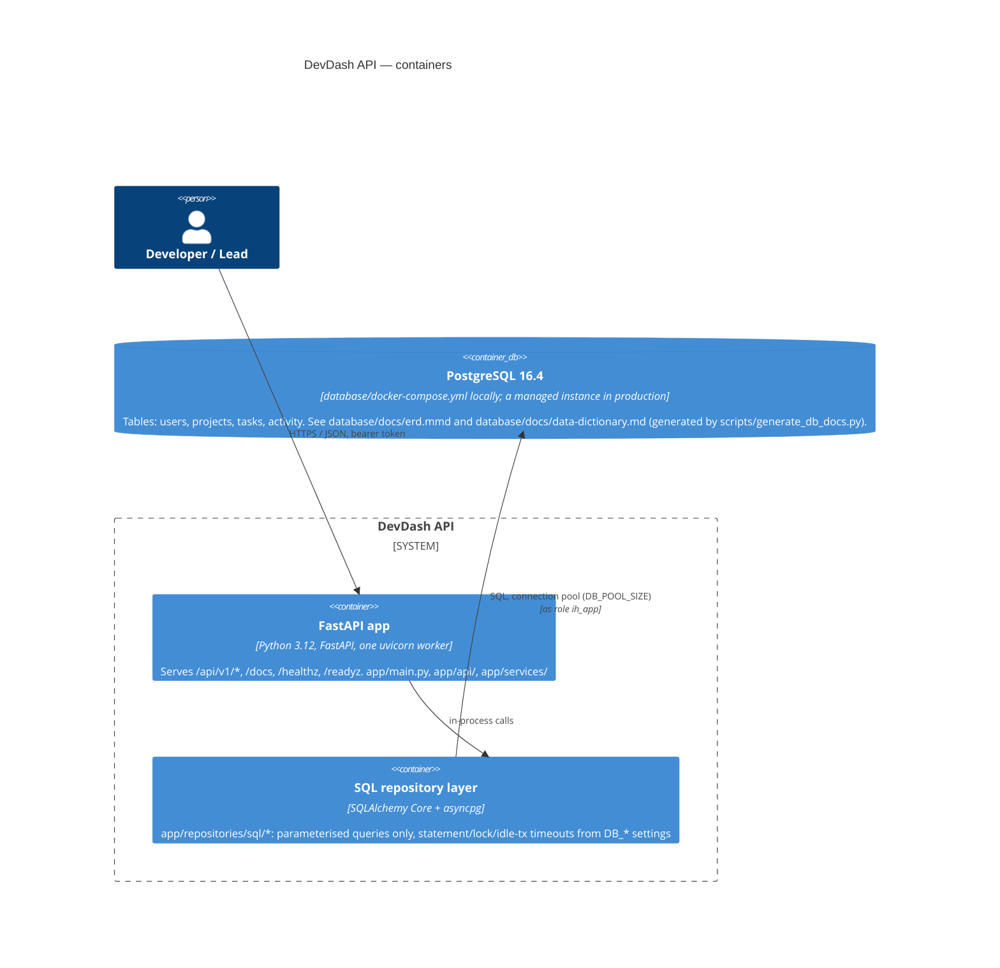

# Architecture: system context and containers

C4-style context and container views of this repository, based on what is
actually deployed and configured here (`render.yaml`, `Dockerfile`,
`database/docker-compose.yml`, `app/core/config.py`), read directly for this
pass. This documents the Task 3 API and its own database only; it does not
describe the Task 1 dashboard's or Task 4 platform's internals beyond how
they connect to this service.

## System context

```mermaid
C4Context
  title DevDash API — system context

  Person(user, "Developer / Lead", "Uses the Task 1 dashboard (or curl/Swagger UI) to manage projects and tasks")
  System(dashboard, "Task 1 dashboard", "Browser client. Calls this API over HTTPS/JSON with a bearer token (CORS_ORIGINS controls which origins may call it).")
  System_Boundary(api, "DevDash API (this repository)") {
  }
  SystemDb_Ext(db, "PostgreSQL 16", "This repository's own database. Not shared with other services.")

  Rel(user, dashboard, "Uses")
  Rel(dashboard, api, "HTTPS / JSON, bearer token", "/api/v1/*")
  Rel(api, db, "SQL over asyncpg", "postgresql+asyncpg://")
```

There is no outbound call from this API to any third-party or AI service:
verified by `grep -rniE "openai|anthropic|third.?party|external.?api|webhook" app/`
during this pass, which returned no matches. The only outbound dependency is
the PostgreSQL database configured by `DATABASE_URL`.

## Container view



## Database roles (from `database/init/roles.sh`, not modified by this pass)

Three PostgreSQL roles are created on first container start, least-privilege
by design:

| Role | Privileges | Used by |
| --- | --- | --- |
| `ih_migrator` | Owns the database; the only role that can create/alter objects | `make db-migrate` only (`MIGRATION_DATABASE_URL`), never the running API |
| `ih_app` | `SELECT, INSERT, UPDATE, DELETE` on tables via default privileges | The running API (`DATABASE_URL`) |
| `ih_readonly` | `USAGE` on schema only; table grants applied per-column in a migration | Reporting/read-only use, not wired into the running API |

## Existing database documentation (not duplicated here)

Per the closeout rule to leave `database/` untouched in this pass, the real,
schema-derived ERD and data dictionary already exist and were verified by
reading them directly:

- `database/docs/erd.mmd` — a Mermaid `erDiagram` with all four tables
  (`users`, `projects`, `tasks`, `activity`), their columns, and their FK
  relationships, generated from the live schema.
- `database/docs/data-dictionary.md` — full column types, defaults, checks,
  indexes and foreign keys per table, generated by
  `scripts/generate_db_docs.py` (`make db-docs` / `make db-docs-check`).

Both are regenerated from the live database, not hand-maintained, so they
are treated as the source of truth here rather than re-derived.

## Manual step

No ERD screenshot exists in `docs/screenshots/` (verified: only
`01-welcome.png`, `02-swagger-overview.png`, `03-invalid-transition-409.png`
are present). Manual step: render `database/docs/erd.mmd` (e.g. with the
Mermaid CLI or the Mermaid Live Editor) and save it as
`docs/screenshots/04-erd.png` for a visual reference alongside this document.
